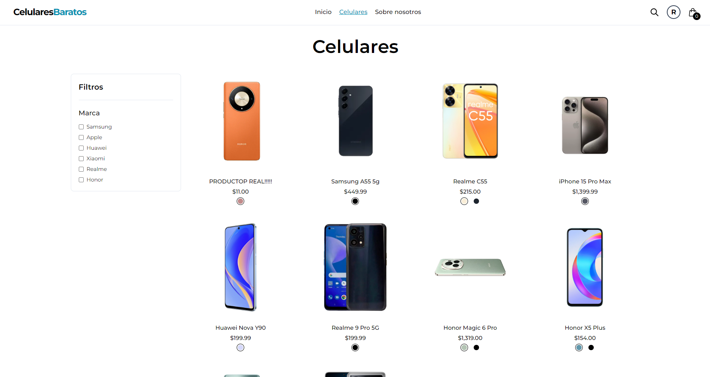
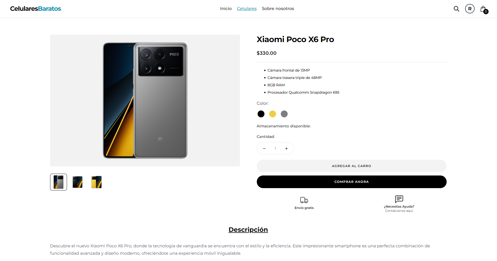
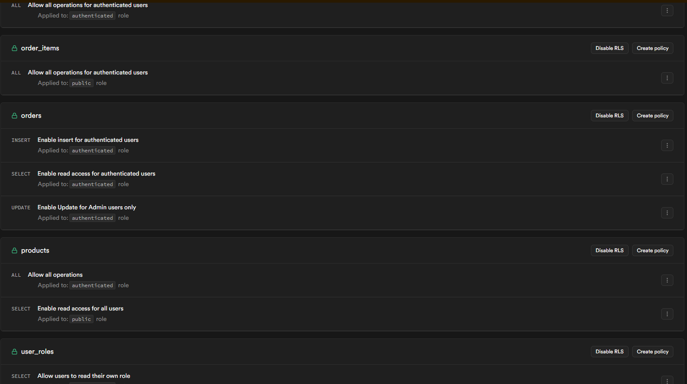
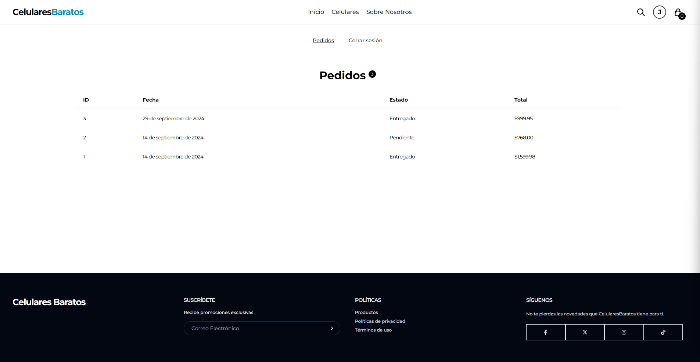
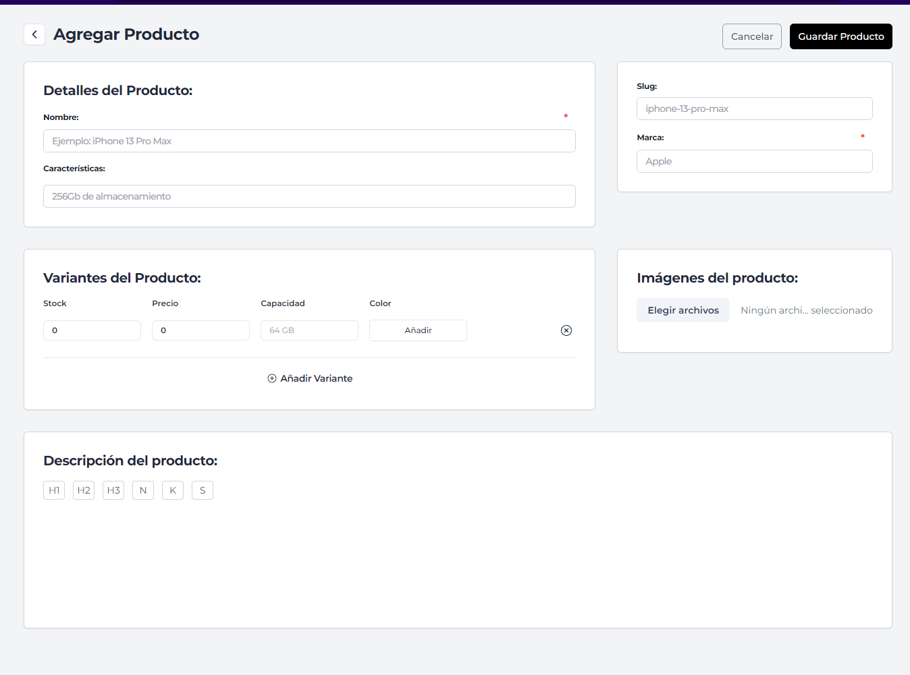

<div align="center">
  <h2 align="center">Aplicación de Ecommerce con React y Supabase</h2>
  
  <div>
    
    
    
    
     
    
    
    
  </div>

   <div align="center">
     Construye este proyecto paso a paso en el siguiente enlace: <a href="https://www.youtube.com/playlist?list=PLfeo9Djx4U-PVLWCAHAf39APkfcPntS2j" target="_blank"><b>Programacion para el mundo</b></a> con 13 vídeos y +16 horas de contenido, aprende algo nuevo!
    </div>
</div>

## Capturas de pantalla

<div style="display: grid; grid-template-columns: 1fr 1fr 1fr;">
  <div style="margin: 10px;">
    
    <p align="center">Cátalogo de celulares</p>
  </div>
  <div style="margin: 10px;">
    
    <p align="center">Página de producto</p>
  </div>
  <div style="margin: 10px;">
    
    <p align="center">RLS Supabase</p>
  </div>
  <div style="margin: 10px;">
    
    <p align="center">Pagina de Pedidos</p>
  </div>
  <div style="margin: 10px;">
    
    <p align="center">Formulario de Producto</p>
  </div>
  <!-- Añade más bloques de imágenes según sea necesario -->
</div>

## 📋 <a name="table">Tabla de contenido</a>

1. 🤖 [Introducción](#introduction)
2. ⚙️ [Tech Stack](#tech-stack)
3. 🔋 [Características](#features)
4. 🤸 [Inicio rápido](#quick-start)
5. 🕸️ [Snippets para copiar](#snippets)
6. 🔗 [Recursos](#links)

## 🚨 Lista de Reproducción

Este repositorio contiene el código correspondiente a un tutorial en profundidad disponible en mi canal de YouTube, [**Programación para el Mundo**](https://www.youtube.com/channel/UCsbPkoSiWpG410Tpc4tAOlQ).

Si prefieres el aprendizaje visual, este es el recurso perfecto para ti. ¡Sigue este curso para aprender a construir proyectos reales como este paso a paso de una manera amigable para intermedios!

[Cómo crear un ecommerce con React, Supabase y Typescript desde cero](https://www.youtube.com/playlist?list=PLfeo9Djx4U-PVLWCAHAf39APkfcPntS2jn)

## <a name="introduction">🤖 Introducción</a>

Construido con React y Supabase, este proyecto es una aplicación de ecommerce completa que permite a los usuarios explorar productos, agregarlos al carrito, realizar compras y gestionar sus pedidos. Es una excelente manera de aprender cómo construir aplicaciones web modernas con tecnologías de vanguardia.

Si estás comenzando y necesitas ayuda o enfrentas algún problema, puedes escribirme a mi [telegram](https://t.me/roberto_anq)

## <a name="tech-stack">⚙️ Tech Stack</a>

- **React**: Biblioteca de JavaScript para construir interfaces de usuario.
- **Supabase**: Plataforma de backend como servicio que proporciona una base de datos Postgres y autenticación.
- **Tailwind CSS**: Framework CSS para diseño rápido y responsivo.
- **TanStack Query**: Librería para el manejo eficiente de datos y estados asíncronos.
- **Zustand**: Pequeña pero potente librería para el manejo del estado global en React.
- **React Hook Form**: Librería para la gestión de formularios en React.
- **Zod**: Librería de validación de esquemas TypeScript-first.

## <a name="features">🔋 Características</a>

👉 **Autenticación de Usuarios**: Registro e inicio de sesión seguros con validaciones utilizando Supabase Auth y Zod.

👉 **Gestión de Productos**: Lista de productos con categorías, búsqueda y detalles individuales.

👉 **Carrito de Compras**: Añadir y eliminar productos del carrito utilizando Zustand para el estado global.

👉 **Procesamiento de Pedidos**: Finalizar compras y gestionar pedidos con actualizaciones en tiempo real gracias a TanStack Query.

👉 **Validación de Formularios**: Formularios robustos y fáciles de manejar con React Hook Form y validaciones con Zod.

👉 **Panel de Administración**: Gestiona productos, categorías y pedidos (si aplica).

👉 **Responsive Design**: Diseño adaptable a diferentes dispositivos gracias a Tailwind CSS.

## <a name="quick-start">🤸 Inicio Rápido</a>

Sigue estos pasos para configurar el proyecto localmente en tu máquina.
**Prerrequisitos**

Asegúrate de tener instalado lo siguiente:

- [Git](https://git-scm.com/)
- [Node.js](https://nodejs.org/es/)
- [npm](https://www.npmjs.com/)

**Clonar el Repositorio**

```bash
git clone https://github.com/roberto-aq/Ecommerce-CelularesBaratos/tree/main

cd Ecommerce-CelularesBaratos
```

**Instalación**

Instala las dependencias usando npm

```bash
npm install
```

**Configuración de las variables de Entorno**
Crea un archivo .env en la raíz del proyecto y añade:

```env
VITE_PROJECT_URL_SUPABASE=
VITE_SUPABASE_API_KEY=
```

Reemplaza los valores de las credenciales con su cuenta correspondiente

**Ejecutar el Proyecto**

```bash
npm run dev
```

Visita [http://localhost:3000](http://localhost:3000) para ver tu aplicación.

## <a name="snippets">🕸️ Snippets</a>

<details>
<summary><code>.env</code></summary>

```env
VITE_PROJECT_URL_SUPABASE=
VITE_SUPABASE_API_KEY=
```

</details>

<details>
<summary><code>supabase.client.ts</code></summary>

```typescript
import { createClient } from '@supabase/supabase-js';
import { Database } from './supabase';

const supabaseKey = import.meta.env.VITE_SUPABASE_API_KEY;
const supabaseUrl = import.meta.env.VITE_PROJECT_URL_SUPABASE;

export const supabase = createClient<Database>(
	supabaseUrl,
	supabaseKey
);
```

</details>

## <a name="links">🔗 Recursos</a>

Imágenes y recursos utilizados en el proyecto [aquí](https://drive.google.com/drive/folders/11R8rcg6Q4riwGgvdXW_SDC5u3NMA-dAM)
